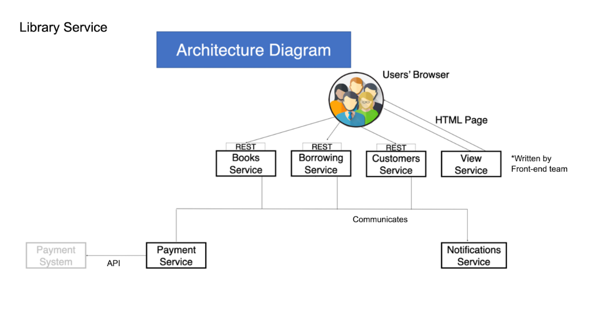
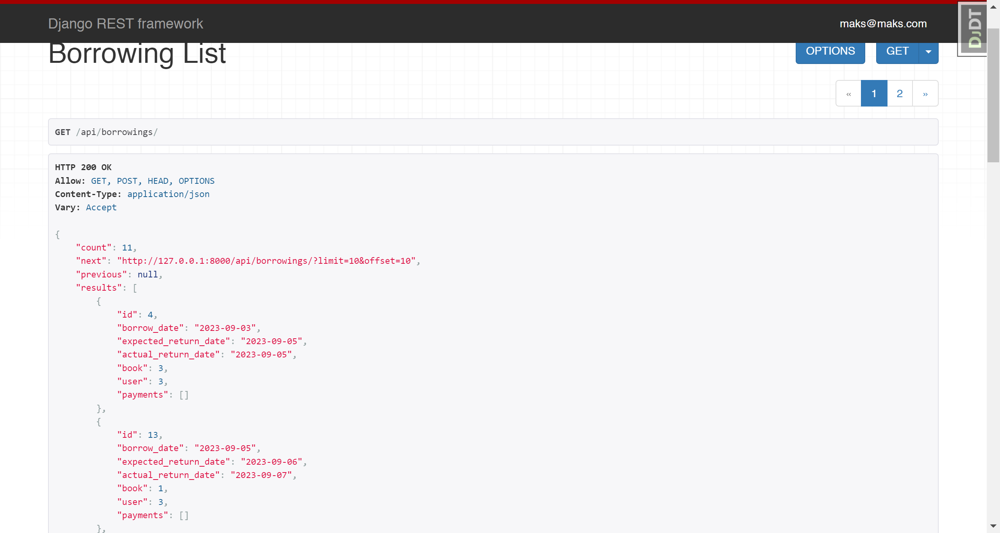

# Library Service API

An online management system for book borrowings on DRF. The system will optimize the work of library administrators and will make the service much more user-friendly.

## Installing using GitHub:

```
git clone https://github.com/MKeSiMu/library-service-project
python -m venv venv
source venv/bin/activate
pip install -r requirements.txt
set SECRET_KEY=<your secret key>
BOT_TOKEN=<your telegram bot token>
CHAT_ID=<your telegram chat ID>
STRIPE_SECRET_KEY=<your Stripe account secret key>
STRIPE_PUBLISHABLE_KEY=<your Stripe account publishable key>
python manage.py migrate
python manage.pyrunserver
```

## Getting access:

- create user via /api/users/
- get access token via /api/users/token

## Features:

- JWT authenticated
- Admin panel /admin/
- Documentation is located at /api/doc/swagger
- Managing books
- Creating borrowings 
- Filtering borrowings by user ID & active borrowings (still not returned)
- Usage of Telegram API, Telegram Chats & Bots for notifications about new borrowing created
- Daily-based function for checking borrowings overdue(Django Celery)
- FINE Payment for book overdue
- Perform payments for book borrowings through the Stripe platform
- List & Detail Payments Endpoint


## Project Diagram



## Demo


